<a href="https://plastic-dive.web.app/" target="_blank">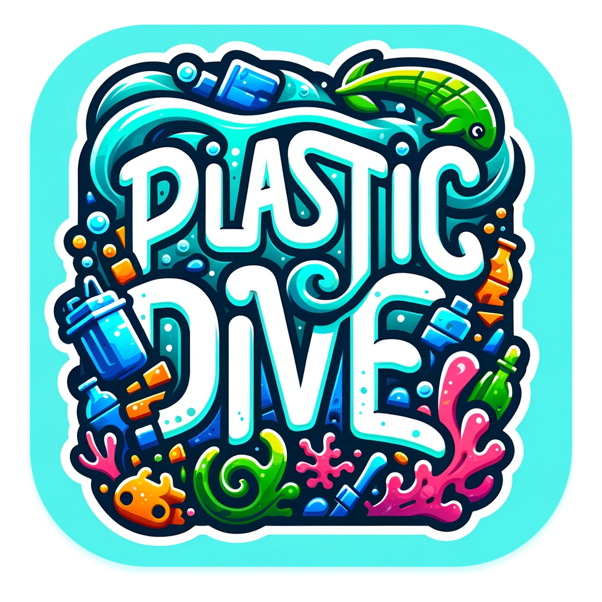</a>

# 🤿 Plastic Dive

We are proud to present our very first game 🙌

We hope you enjoy it!

### 🎮 [Play the game (Web)](https://plastic-dive.web.app/)

Or via
- [Android build](https://github.com/n0mad-d3v/plastic-dive/releases/download/v0.1.0/android-plasticdive.apk)
- [iOS TestFlight](https://testflight.apple.com/join/gNRCVc11)

## 🐡 Description

### 🎯 Objectives

Plastic Dive is a small game where you play the role of a diver who has to collect plastic waste in the ocean. Each garbage collected will give you points and those can be used to upgrade your diver to dive and swim deeper, faster, longer or to improve your garbage collection speed. But make sure to be back at the surface before your oxygen tank is empty or you will lose the game and all the points you have collected. Be the best diver and reach the top of the leaderboard 🏆

The game is also educational and will teach you about the plastic pollution and the animals living in the ocean. The game is compatible with Android, iOS, Web, MacOS, Windows and Linux.  
You can play it either with the keyboard arrows or by tapping on the screen.

### 🏆 Global Gamers Challenge 2024

This game has been made for the Global Gamers Challenge 2024. The [Global Gamers Challenge](https://flutter.dev/global-gamers) is an 8-week contest to design, build, and publish sustainable games, sponsored by Flutter and Global Citizen. Inspired by the mission of the United Nations-facilitated Playing for the Planet Alliance, which Google joined in 2023, international advocacy organization Global Citizen and Flutter, Google’s open-source framework for building multi-platform applications are partnering to host the Global Gamers Challenge.

## 🤿 Features

- [x] Game is fully functional and has been tested on multiple devices
- [x] Each garbage gives you points and requires a different time to collect, right choices to be made!
- [x] Diver has an oxygen tank that empties over time, to win the game and earn the points, the diver must be back at the surface before the oxygen tank is empty
- [x] Diver can be upgraded with the points earned during the game to increase dive depth (unlock animals), swimming speed, garbage collection speed and oxygen tank capacity
- [x] Tutorial to explain how to play the game on the first launch (+ available from main menu)
- [x] Infocean screen with information about the plastic pollution and the animals
- [x] Leaderboard with the best scores
- [x] Music, sounds and effects during the game (with the possibility to mute them)
- [x] Compatible with Android, iOS, Web, MacOS, Windows and Linux
- [x] Screens and game are responsive to any screen size

## 📷 Screenshots

| Feature / screen  | 📱 Mobile | 💻 Desktop |
| ------------- | ------------- | ------------- |
| Home screen | 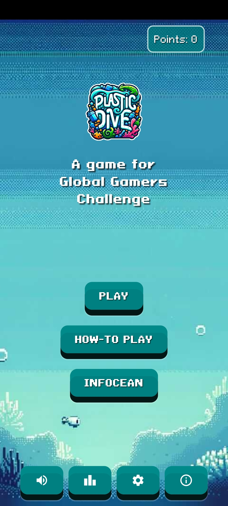  | 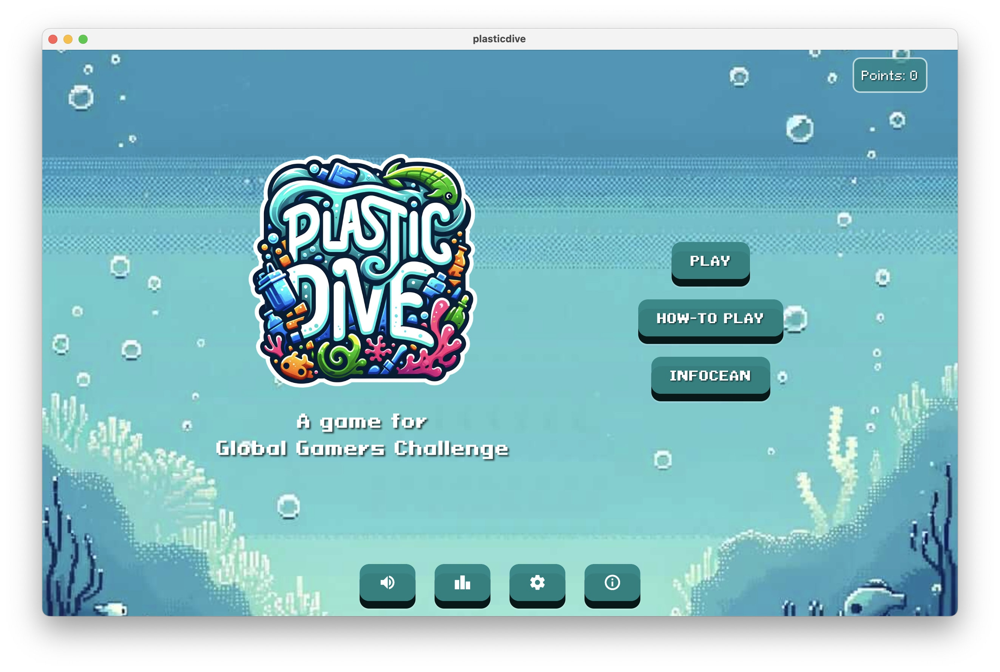  |
| Introduction / Tutorial  | 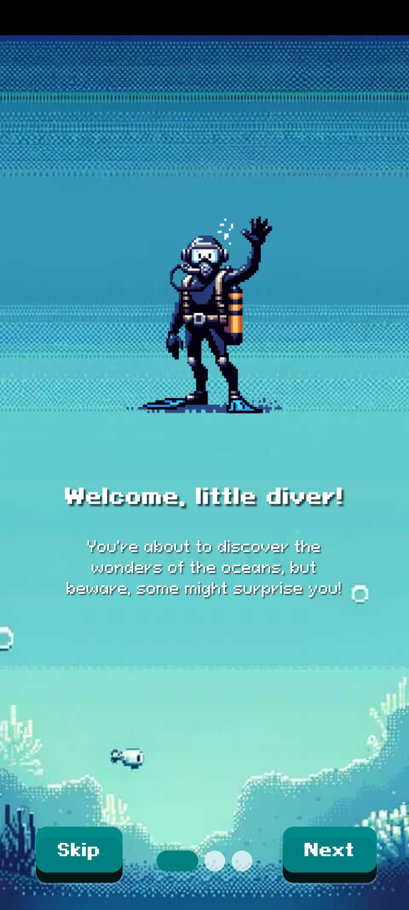  | 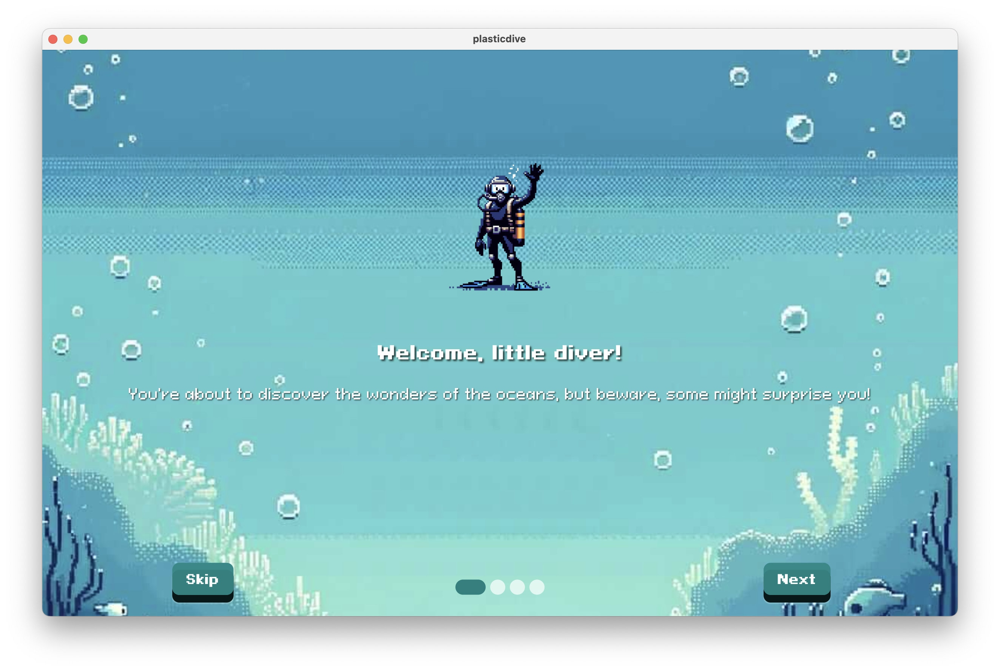  |
| In game  | 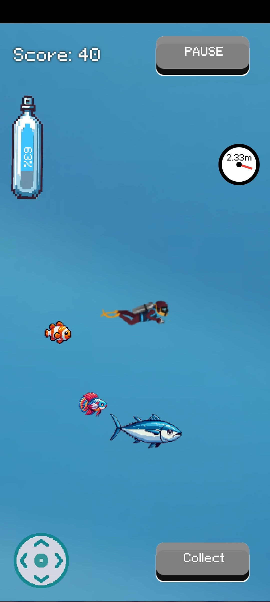  | 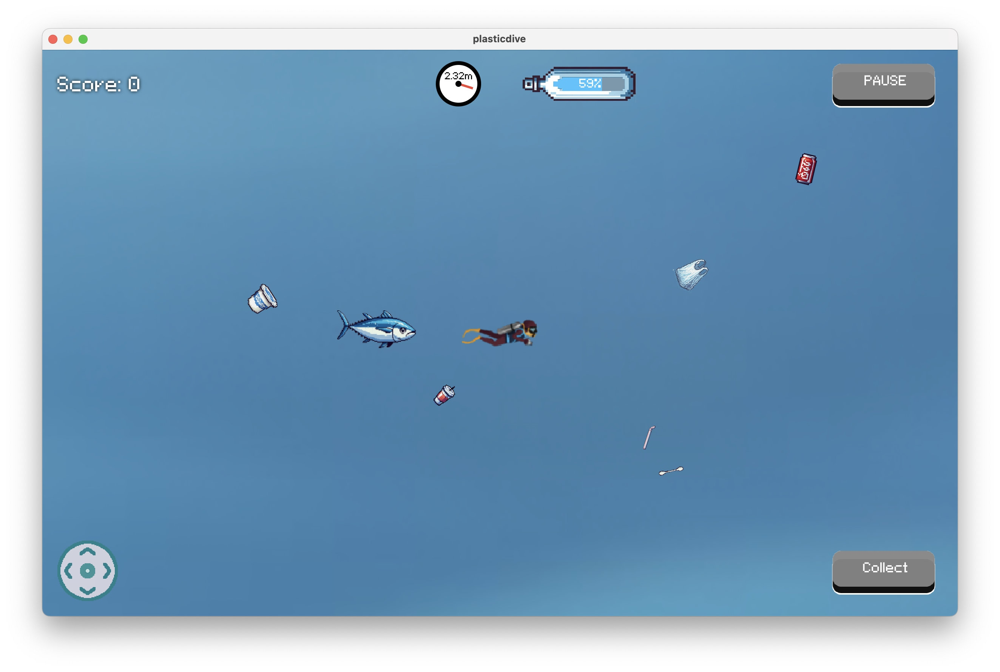  |
| In game  | 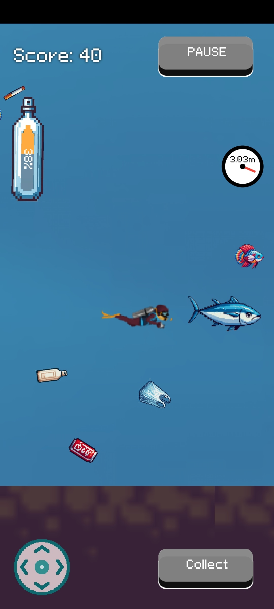  | 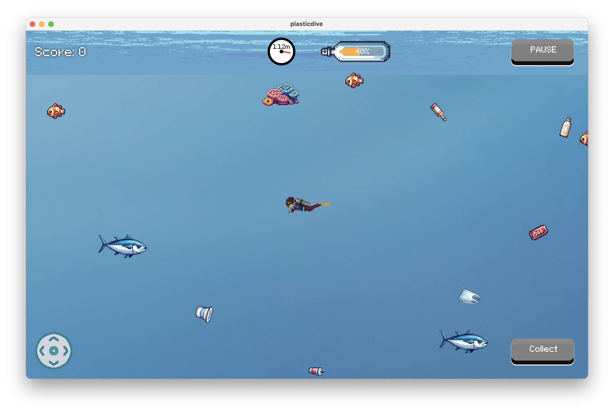  |
| Win  | 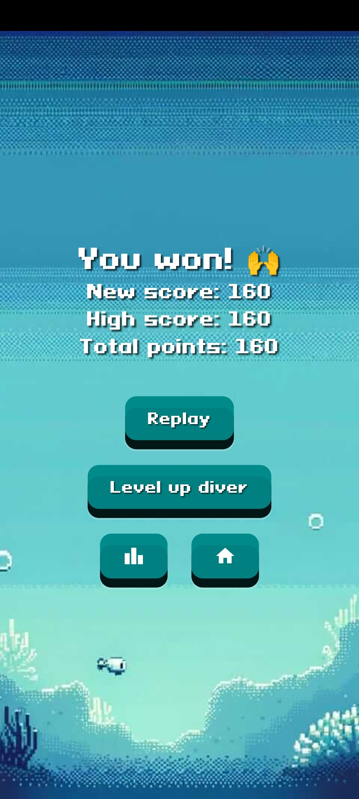  | 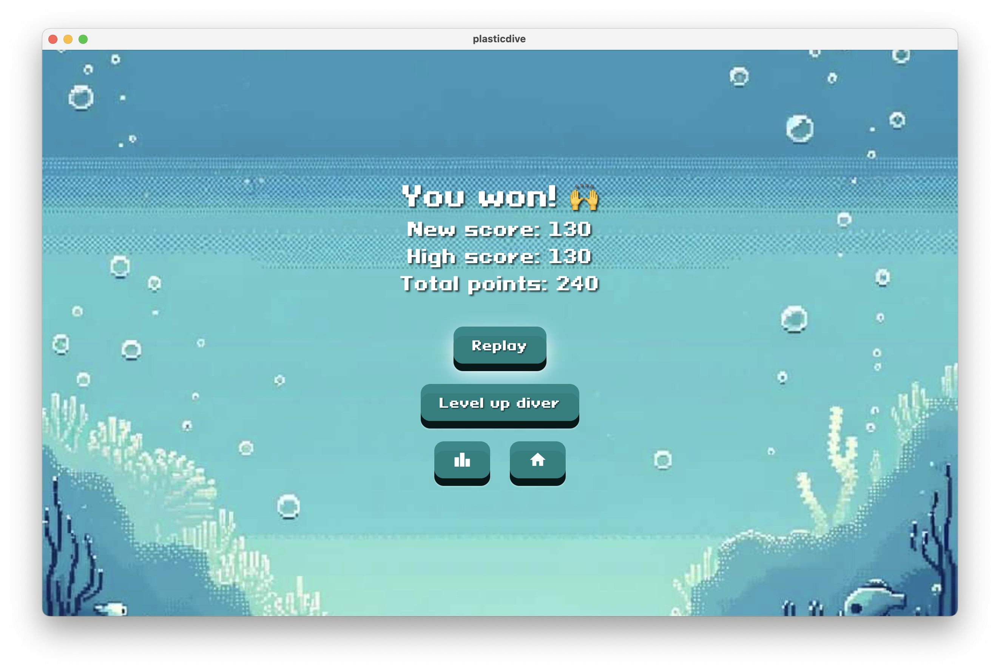  |
| Upgrade diver  | 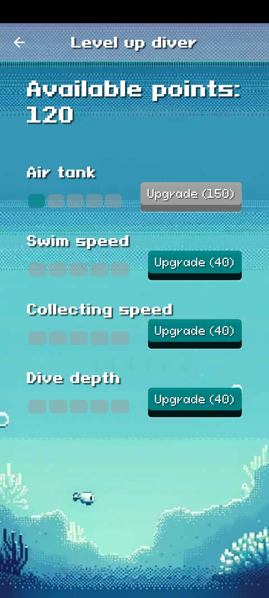  | 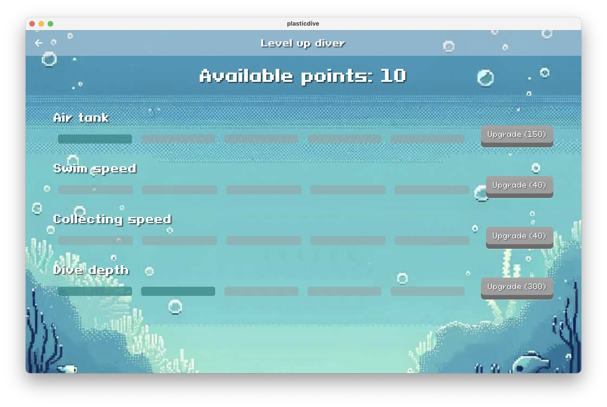  |
| Leaderboard  | 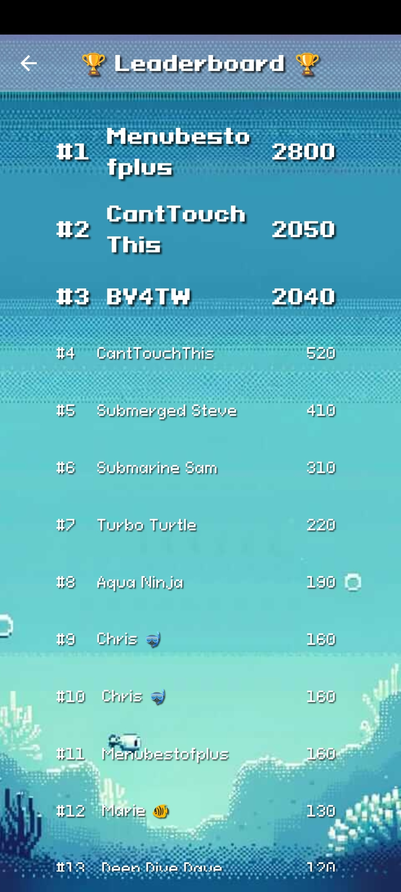  | 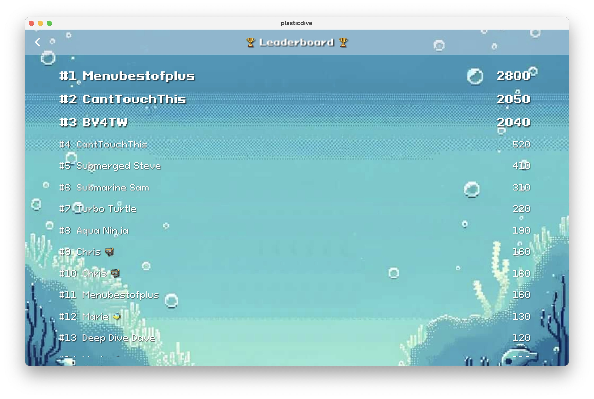  |
| Infocean / Educational content  | 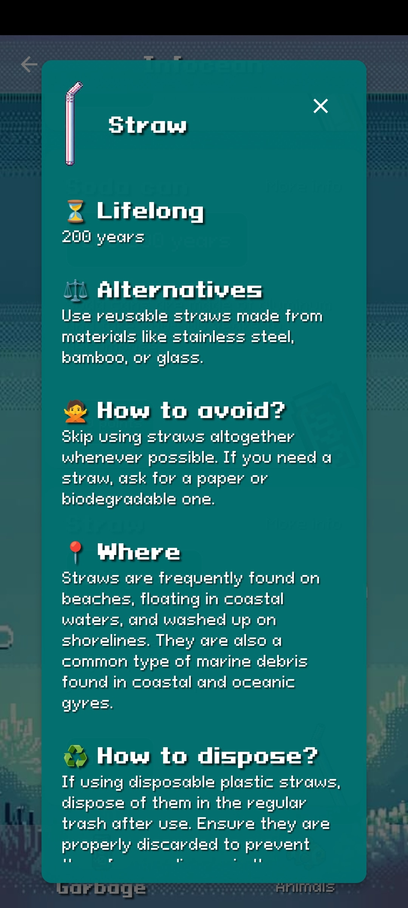  | 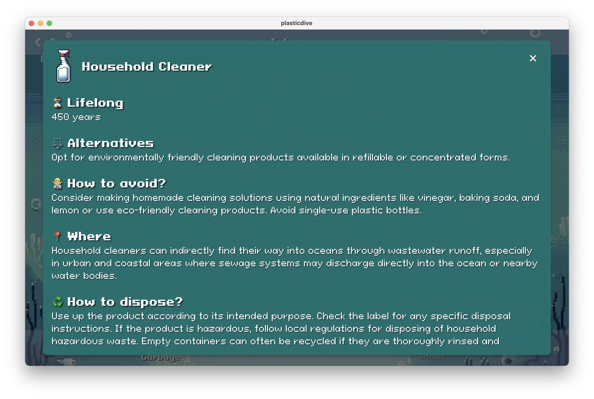  |

And more in the [screenshots](screenshots) folder!

## 📼 Video

[https://www.youtube.com/shorts/20txhB9Rpxc](https://www.youtube.com/shorts/20txhB9Rpxc)

### 💬 Transcript

Our oceans are so deep and full of life... But also, full of plastic. Let's be honest, we are responsible for this, but we can also be part of the solution.

Introducing you: Plastic Dive, our game for the Global Gamers Challenge! Dive deep into vibrant underwater environments, and discover the colorful lives who are fighting against this plastic.

Your mission? Clean up the ocean by collecting and disposing of plastic waste. The more waste you collect, the more points you will have to spend to improve your diver to dive deeper, faster, longer! But make sure to be back at the surface before your oxygen tank is empty or you will lose the game and all the points you have collected… and all waste will be back in the ocean. Be the best diver and reach the top of the leaderboard 🏆

But Plastic Dive is not just a game – it's a call to action. As you progress through the game, you'll unlock real-world tips and facts about plastic pollution, empowering you to make positive changes in your own life to reduce plastic waste and protect our oceans.

Get ready to embark on a meaningful adventure and try "Plastic Dive" now to join the fight against plastic.

## 🕹️ How to play the game?

📱 On mobile, you can play the game by using the joystick to make the diver swim and use the collect button to collect the garbage.

💻 On computer, you can also use the keyboard arrows to move the diver and the space bar to collect the garbage.

The game is over when the oxygen tank is empty, so make sure to be back at the surface before it is too late!

## ▶️ How to run the app?

- Clone the repository
- Run `flutter pub get`
- Run `flutter run`
- Enjoy the game!

## ℹ️ About us

This game was created by [Marie Incourt](https://www.linkedin.com/in/marie-incourt/) and [Christophe Leemans](https://www.linkedin.com/in/christopheleemans/).

### Our roles in this adventure

- **Marie**:
  - Inspiration / Creation of the idea, the concept
  - DALL-E whisperer to create the assets for the games (animals, garbage, logo, backgrounds...)
  - Project Manager
  - Educational content teacher
  - Quality Assurance & bugs finder

- **Christophe**:
  - Flutter / Flame development
  - Bugs creator (and hopefully fixer)
  - Game master
  - Testing on multi-platforms

## 🛠️ Technologies

- Cross-Platform App Framework: [Flutter](https://flutter.dev/)
- Game Engine: [Flame](https://flame-engine.org/)
- Architecture Framework: [Stacked](https://pub.dev/packages/stacked)
- Leaderboard Storage: [Cloud Firestore](https://firebase.google.com/docs/firestore)

### Other packages

- [shared_preferences](https://pub.dev/packages/shared_preferences)
- [flame_audio](https://pub.dev/packages/flame_audio)
- [animations](https://pub.dev/packages/animations)
- [introduction_screen](https://pub.dev/packages/introduction_screen)
- [meta_seo](https://pub.dev/packages/meta_seo)

## 🙏 Special thanks to

🌍 Our earth for being so beautiful and inspiring us to create this game. Let's not forget to protect it!

🙌 Our friends testing the game and giving us feedback. (You know who you are! Even if you didn't test it, you are still our friend!)

🚀 Flutter, Flame, Stacked for their frameworks helping us to shape our crazy ideas into a game. Global Citizen for their challenge idea and inspiration.

🤖 DALL-E for the amazing icon and images we used in our game. (We are still working on our own art skills! 😅)

🫵 And last but not least, you for playing our game! We hope you enjoy it and that it will make you think about the plastic pollution and the animals living in the ocean.

### Assets

We also want to thank the following artists for their amazing work:

- [Diver sprite by Fellowship Of the Game](https://opengameart.org/content/scuba-diver)
- [At Depth by Lish Grooves](https://soundcloud.com/lishgrooves/at-depth)
- [Underwater Whale And Diving Sound Ambient by Saturn-3-Music](https://pixabay.com/sound-effects/underwater-whale-and-diving-sound-ambient-116185/)
- [SFX effects by mixkit.co](https://mixkit.co/free-sound-effects)
- Music from #Uppbeat (free for Creators!): https://uppbeat.io/t/monument-music/travel-in-the-ocean License code: TZLYBEUNZGDJ6JD7

We couldn't have made this game without you! 🙏

## 🔮 Future evolutions

- [ ] I18N
- [ ] Add more animals and garbage
- [ ] Publish the game on stores
- [ ] Add more educational content about the plastic pollution and the animals
- [ ] Display a video from Global Citizen when the player loses get x more seconds and to raise awareness about the plastic pollution
- [ ] Create custom Google Wallet cards for the animals
- [ ] Add haptic feedback
- [ ] Add the possibility to share the game
- [ ] Add the possibility to rate the game
- [ ] Add the possibility to report a bug
- [ ] Add the possibility to contact the support
- [ ] Add the possibility to change the language
- [ ] Do a daily / weekly / all the time leaderboard
- [ ] Add a in-game tutorial to explain how to play the game instead of a separate screen
- [ ] Add a news screen to display the latest news about the plastic pollution

## 💌 Contact / Feedback

If you
- have any feedback or want to contact us, feel free to reach out to us on [LinkedIn](https://www.linkedin.com/in/christopheleemans/).
- want to report a bug, you can also open an issue on this repository.
- want to contribute to the game, feel free to open a pull request.
- want to share the game, feel free to do so! We would be happy to see our game being played by many people.
- want to send us a gift, go snorkeling or diving, collect some garbage in the ocean, then send us a picture! This would be our best gift 🌊